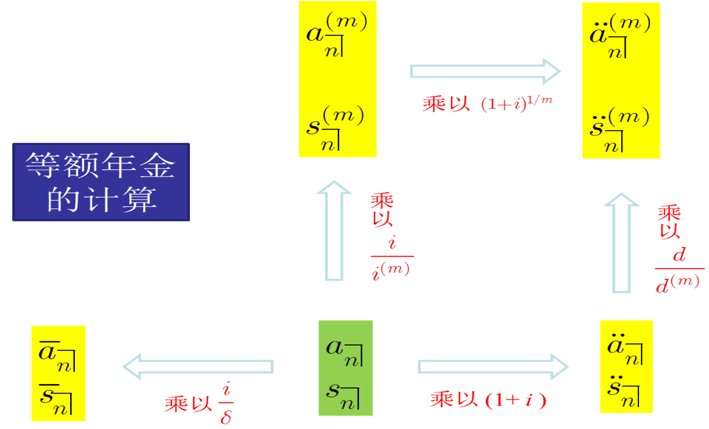

# Level annuity

## Key concepts

### Annuity immediate{-}

### Annuity due{-}

### Deffered annuity{-}

### Perpetuity{-}

### $m$-thly payable annuity {-}

### Continuous payable annuity {-}

## Key equations

```{r,echo=FALSE}

```

