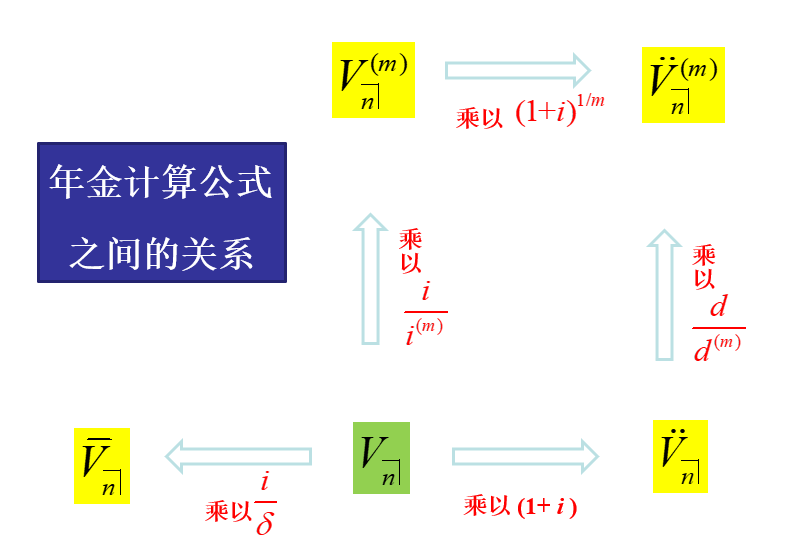

# Varying annuity

## Key concepts

### Increasing annuity immediate {-}

$$(Ia)_{\overline{n}\mid}=\frac{\ddot{a}_{\overline{n}\mid}-nv^n}{i}$$
$$(Is)_{\overline{n}\mid}=(1+i)^n(Ia)_{\overline{n}\mid}$$

### Increasing annuity due {-}

$$(I\ddot{a})_{\overline{n}\mid}=(1+i)(Ia)_{\overline{n}\mid}$$

$$(I\ddot{s})_{\overline{n}\mid}=(1+i)(Is)_{\overline{n}\mid}$$

### Decreasing annuity immediate {-}

$$(Da)_{\overline{n}\mid}=\frac{n-a_{\overline{n}\mid}}{i}$$

### Compound increasing annuity immediate {-}

$$(Ca)_{\overline{n}\mid i}=\frac{(C\ddot{a})_{\overline{n}\mid i}}{1+i}=\frac{\ddot{a}_{\overline{n}\mid j}}{1+i}\neq{a}_{\overline{n}\mid j},$$
where $j=(i-r)/(1+r).$

### Compound increasing annuity due {-}

$$(C\ddot{a})_{\overline{n}\mid i}=\ddot{a}_{\overline{n}\mid j},$$
where $j=(i-r)/(1+r).$

### $m$-thly payable increasing annuity immediate {-}

$$(Ia)^{(m)}_{\overline{n}\mid}=\frac{i}{i^{(m)}}(Ia)_{\overline{n}\mid}$$

### $m$-thly payable increasing annuity due {-}

$$(I\ddot{a})^{(m)}_{\overline{n}\mid}=\frac{d}{d^{(m)}}(I\ddot{a})_{\overline{n}\mid}$$

### $m$-thly payable varying annuity {-}

The above equations are also applied to decreasing annuity and compound increasing annuity. In general we have 

$$V^{(m)}_{\overline{n}\mid}=\frac{i}{i^{(m)}}V_{\overline{n}\mid}$$
$$\ddot{V}^{(m)}_{\overline{n}\mid}=\frac{d}{d^{(m)}}\ddot{V}_{\overline{n}\mid}$$

### Continuous payable varying annuity {-}

$$\bar{V}_{\overline{n}\mid}=\frac{i}{\delta}V_{\overline{n}\mid}=\frac{d}{\delta}\ddot{V}_{\overline{n}\mid}$$

### Increasing perpetuity {-}

$$(Ia)_{\overline{\infty}\mid}=\frac{1}{di}$$

### Continuous payable increasing perpetuity {-}

$$(I\bar{a})_{\overline{\infty}\mid}=\frac{1}{d\delta}$$

### Present value of a general varying annuity with payment rate of $\rho(t)$ {-}

$$\int_0^{\infty}\rho(t)\exp\left(-\int_0^t\delta(s)ds\right)dt$$

### Cumulative value of a general varying annuity with payment rate of $\rho(t)$ {-}

$$\int_0^{T}\rho(t)\exp\left(\int_t^T\delta(s)ds\right)dt$$

### Continuously increasing annuity with payment rate of $t$ {-}

$$(\bar{I}\bar{a})_{\overline{n}\mid}=\int_0^nte^{-\delta t}dt=\frac{\bar{a}_{\overline{n}\mid}-nv^n}{\delta}$$

### Continuously increasing perpetuity {-}

$$(\bar{I}\bar{a})_{\overline{\infty}\mid}=\frac{1}{\delta^2}$$

### Continuously decreasing annuity with payment rate of $n-t$ {-}

$$(\bar{D}\bar{a})_{\overline{n}\mid}=\int_0^n (n-t) e^{-\delta t}dt=\frac{n-\bar{a}_{\overline{n}\mid}}{\delta}$$

## Key relations

