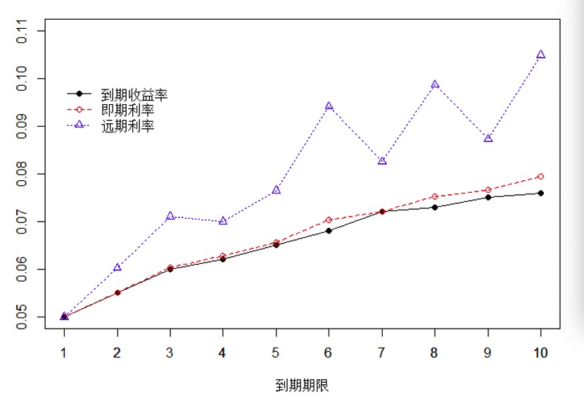

# Term Structure of Interest Rate

**Yield to maturity**: The internal rate of return which makes NPV as zero.

**Spot rates**: The interest rates in the next $t$ years, denoted by $s_t$.

**Forward rates**: The interest rates of the year $t$, denoted by $f_{t-1}$. Note that $f_0=s_1, s_t=s_{t-1}f_{t-1}$.

